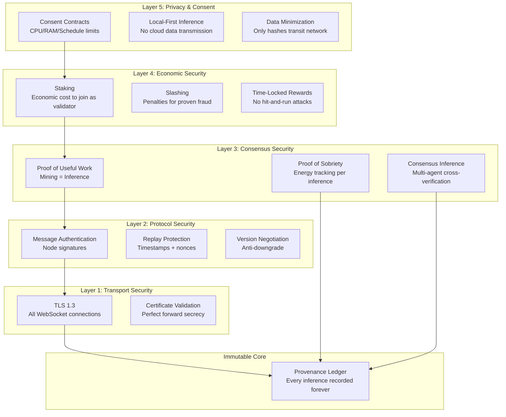

# ARIA Security Architecture

## Defense-in-Depth Model

ARIA Protocol implements a five-layer defense-in-depth security architecture. Each layer operates independently, ensuring that a failure in one layer is caught by others.

## Layer Details

### Layer 1 — Transport Security (Implemented ✅)

All node-to-node communication uses TLS 1.3 over WebSocket Secure (WSS). This prevents eavesdropping, tampering, and man-in-the-middle attacks at the network level.

**Implementation:** `aria/network.py` — Self-signed certificate generation with automatic TLS upgrade.

### Layer 2 — Protocol Security (Implemented ✅)

Messages include node ID verification, timestamps for replay protection, and protocol version negotiation to prevent downgrade attacks.

**Implementation:** `aria/network.py` — Message structure includes `sender_id`, `timestamp`, and `protocol_version` fields.

### Layer 3 — Consensus Security (Implemented ✅ / Designed 📐)

This is ARIA's core innovation — **Proof of Useful Work** means mining IS inference. There is zero wasted computation.

| Mechanism | Status | Description |
|-----------|--------|-------------|
| Proof of Useful Work | ✅ Implemented | Every reward requires actual AI inference. Output hashes and timing are recorded. Suspiciously fast responses trigger re-verification. |
| Proof of Sobriety | ✅ Implemented | Energy consumption per inference is estimated via CPU-time × TDP and cross-referenced with hardware capabilities. Statistical outlier detection flags impossible energy claims. |
| Provenance Ledger | ✅ Implemented | Immutable chain recording every inference: query hash, output hash, participating nodes, energy consumed, model used, timestamp. |
| Consensus Inference | 📐 Designed | Multi-agent orchestrated debate (SLM-MUX routing). Multiple nodes independently process the same query, and results are cross-verified. A node consistently producing low-quality or divergent outputs sees its reputation score decrease. |

**Implementation:** `aria/proof.py`, `aria/ledger.py`

### Layer 4 — Economic Security (Designed 📐)

Economic mechanisms create real financial cost for attacks, making cheating unprofitable.

| Mechanism | Target Version | Description |
|-----------|---------------|-------------|
| Staking | v0.7.0 | Validators must stake $ARIA tokens. Creates economic cost for Sybil attacks. |
| Slashing | v1.0.0 | Proven fraud (falsified inference, energy fraud) results in stake confiscation. |
| Time-locked rewards | v1.0.0 | Rewards vest over time, preventing hit-and-run attacks. |
| Reputation system | v0.7.0 | Slow accrual, fast decay. Long-term honest behavior is rewarded; a single fraud incident has lasting consequences. |

**Design:** Documented in [Tokenomics v2.1](../ARIA_Tokenomics_v2_1.docx) §5 "Mécanismes anti-abus"

### Layer 5 — Privacy & Consent (Implemented ✅)

ARIA's consent-first approach means no resource is ever used without explicit permission from the node operator.

| Mechanism | Status | Description |
|-----------|--------|-------------|
| Consent Contracts | ✅ Implemented | Node operators define exact limits: max CPU %, max RAM, operating hours, allowed task types. |
| Local-First Inference | ✅ Implemented | Inference runs on the user's own hardware. Prompts never leave the local machine unless explicitly shared. |
| Data Minimization | ✅ Implemented | Only cryptographic hashes of inputs/outputs transit the network for verification. Raw data stays local. |
| End-to-end encryption | ⬜ Planned | Full prompt encryption for distributed inference scenarios. |

**Implementation:** `aria/consent.py`

## Anti-Cheat Matrix

How each attack vector is addressed across multiple layers:

| Attack | Layer 1 | Layer 2 | Layer 3 | Layer 4 | Layer 5 |
|--------|---------|---------|---------|---------|---------|
| Sybil (fake nodes) | — | Rate limiting | PoUW requires real compute | Staking cost | — |
| Result falsification | — | Message auth | Output hash + timing | Slashing | — |
| Energy fraud | — | — | PoS cross-reference | Slashing | — |
| MITM eavesdropping | TLS 1.3 | — | — | — | E2E encryption |
| Eclipse (isolation) | — | Peer diversity | Bootstrap nodes | — | — |
| Prompt leakage | TLS 1.3 | — | — | — | Local inference |
| Pipeline poisoning | — | Checksums | Activation validation | Reputation decay | — |
| Reward gaming | — | — | PoUW ties rewards to work | Time-locked rewards | — |

## Comparison with Competitors

| Security Feature | ARIA | Bittensor | Gensyn | Render | Petals |
|-----------------|------|-----------|--------|--------|--------|
| Documented threat model | ✅ Public | ❌ None | ❌ None | ❌ None | ❌ None |
| Proof mechanism | PoUW + PoSobriety | Yuma Consensus | Verde (PoL) | Trust score | None |
| Energy tracking | ✅ Per-inference | ❌ | ❌ | ❌ | ❌ |
| Consent system | ✅ Granular | ❌ | ❌ | ❌ | ❌ |
| Privacy-first | ✅ Local inference | ❌ | ❌ | ❌ | Partial |
| Open threat model | ✅ | ❌ | ❌ | ❌ | ❌ |
| SECURITY.md in repo | ✅ | ❌ (Issue #1819) | ❌ | ❌ | ❌ |

## Security Roadmap

| Version | Security Milestone |
|---------|-------------------|
| v0.2.5 ✅ | TLS/WSS, threat model, self-signed certs |
| v0.5.x ✅ | Security policy (SECURITY.md), defense-in-depth documentation |
| v0.6.0 | Peer diversity requirements, certificate pinning |
| v0.7.0 | Reputation system, stake-based Sybil resistance |
| v1.0.0 | Slashing, hardware attestation, third-party audit, bug bounty |

---

*For vulnerability reports, see [SECURITY.md](../SECURITY.md).*
*For the full threat analysis, see [Threat Model](threat-model.md).*
